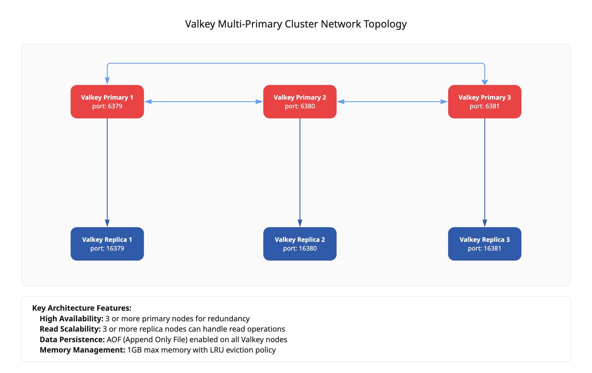
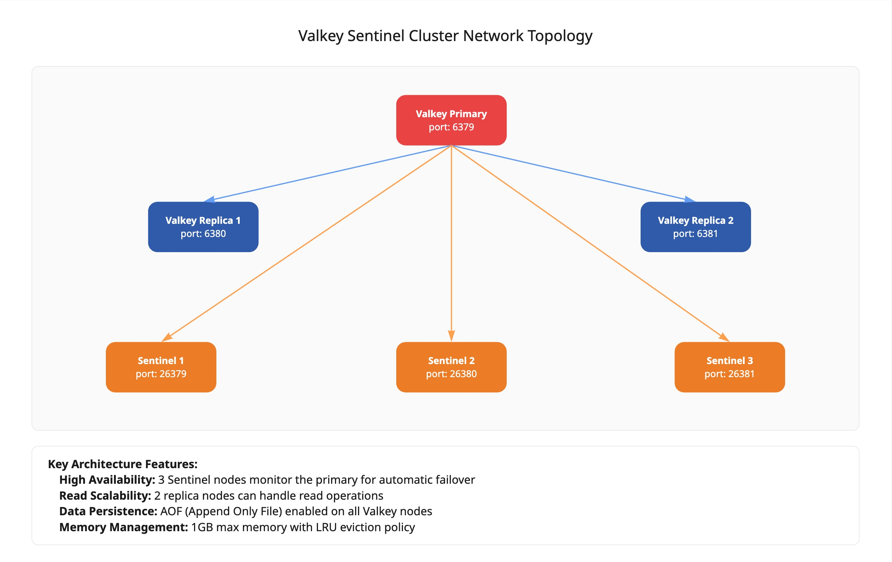

# PMM Automation Playbooks

This repository contains a collection of ansible playbooks that automate a variety of tasks related to PMM (Percona Monitoring and Management). The playbooks are designed to simplify routine tasks, making it easier to test a specific database configuration with PMM.

## MySQL

### MySQL Cluster with Async Replication

This playbook provisions a [MySQL cluster](./mysql/mysql-async/README.md) with asynchronous replication. It sets up the necessary configurations and ensures that the cluster is ready for use.

### MySQL Cluster with Group Replication

This playbook provisions a [MySQL cluster](./mysql/mysql-group/README.md) with group replication. It configures the cluster and ensures that all nodes are properly synchronized.

## Valkey/Redis

### Valkey/Redis Multi-Source Cluster with Replication

This playbook provisions a Valkey/Redis multi-master cluster with replication between the nodes. It sets up the cluster with redundancy to prevent data loss.

The following diagram help visualize the cluster network topology:



### Valkey Sentinel Cluster with Replication

This playbook provisions a Valkey Sentinel cluster with replication. It configures the sentinel nodes to monitor Valkey source instances and handle failover automatically.

The following diagram help visualize the cluster network topology:


## Networking

For the sake of simplicity, all playbooks are designed to run on a single host. However, they can be adapted for multi-host setups if needed. Therefore, the playbooks assume that all containers are running on the same host and within the same container network. The communication between the containers is handled through the Docker network, allowing them to interact seamlessly, using the container names as hostnames.

## Running the Playbooks
To run any of the playbooks, navigate to the corresponding directory and execute the playbook using the following command:

```bash
ansible-playbook <playbook>.yml
```

Ensure that you have the necessary directory permissions before running the playbook. Some playbooks may persist data in the user's home directory, so make sure the home directory is writable.

Docker images will be pulled automatically if they are not available locally. If you want to use a specific version of the Docker images, you can modify the playbook to specify the desired image tags.

## Cleaning Up
To clean up the environment after running the playbooks, you can use the `cleanup.sh` script provided in each directory. This script will stop and remove all containers and volumes (if applicable) created by the playbook, ensuring that your environment is clean for the next run.

```bash
./cleanup.sh
```
